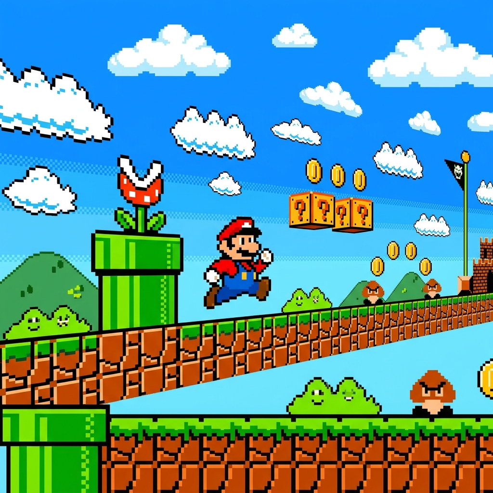

<div align="center">
  

  # 🍄 Super Mario Runner 🍄

  **Um divertido jogo de navegador inspirado no clássico Super Mario Bros!**

  [](#)
  [](#)
  [](#)
</div>

<br>

## 🎮 Sobre o Jogo
**Super Mario Runner** é um "endless runner" (jogo de corrida infinita) desenvolvido puramente com HTML, CSS e JavaScript (Vanilla). Ajude o Mario a desviar dos icônicos canos verdes, alcance a maior pontuação possível e sobreviva o máximo que puder!

## 🌟 Funcionalidades
- **Sistema de Vidas (❤️❤️❤️):** Você pode cometer alguns erros antes de ver a tela de Game Over.
- **Dificuldade Progressiva:** O jogo fica mais rápido e o intervalo entre os canos diminui conforme você pontua, aumentando o desafio!
- **Sons Nostálgicos:** Efeitos sonoros imersivos para saltos, pontuação, dano e, claro, o famoso tema clássico.
- **Interface Intuitiva:** Um menu inicial polido, tela de pausa e sistema de "Jogar Novamente".
- **Design Responsivo:** Jogue no computador (usando a barra de *Espaço*) ou pelo celular (tocando na tela).

## 🚀 Como Jogar

1. Baixe os arquivos do projeto ou faça um clone do repositório.
2. Abra o arquivo `index.html` em qualquer navegador moderno.
3. Clique em **Iniciar Jogo**.
4. Pressione a tecla **ESPAÇO** ou **TOQUE NA TELA** para pular sobre os canos.
5. Se precisar, aperte a tecla **ESC** ou clique no botão de pausa para pausar o jogo.

## 📂 Estrutura de Pastas
O projeto segue uma estrutura moderna e organizada:

```text
super-mario-js/
├── assets/
│   ├── audio/      # Efeitos sonoros e música tema
│   └── img/        # Sprites, gifs do Mario, nuvens e canos
├── css/
│   └── styles.css  # Folhas de estilo e animações do jogo
├── js/
│   └── script.js   # Lógica do jogo (game loop, colisões, pontuação)
├── index.html      # Estrutura principal e importação dos recursos
└── README.md       # Documentação do projeto
```

## 🛠️ Tecnologias Utilizadas
- **HTML5:** Estrutura e carregamento de áudios/imagens.
- **CSS3:** Estilização geral, posicionamento absoluto/relativo e animações complexas via `@keyframes`.
- **JavaScript:** Manipulação do DOM, controle de estados (pausa, fim de jogo, contagem de vidas) e cálculo de colisões de hitboxes.

<br>

<div align="center">
  <sub>Criado com carinho e muita nostalgia! 🍄🌟</sub>
</div>
